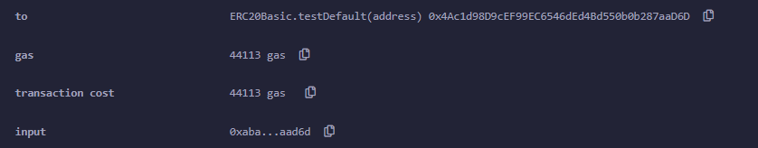

# enDe - Max precompile KYC Blockchain

enDe is a blockchain network build using avalanche subnets & precompile evm, with custom evm features.

## Repos
- [Precompile Evm](https://github.com/manojkgorle/precompile-evm-extended)(This repo)
- [NodeJs Backend for KYC](https://github.com/manojkgorle/improved-couscous)
- [NextJs frontend for KYC](https://github.com/aditya-git16/potential-fishstick)

## Features
- KYC 
- Native support for **Eddsa25519** curve using precompile
- Native **RandUint256** generator
- Custom **Mapping** precompile

## About, Why, Uses of KYC
- For transacting on enDe chain, users need to complete their KYC. KYC is benefitial for removing the anonymity provided by BlockChains as Default.
- We have experienced several rekts(Exploits) resulting in $Billions of loses, in Defi & NFT space from the starting.
- The culprits are never identified(many times) because of their anonymity. So removing the anonymity, reduces rekts on Blockchains
- KYC is useful for onboarding specific set of users, using governance by current users of Blockchain.

## Precompiles

### Eddsa25519:
- Precompile Address: `0x03000000000000000010`
- Eddsa25519 is one of the most vividly used curve in modern day cryptography for its security & speed.
- Eddsa25519 curve is used for aggregated signatures submited by Zeroknowledge rollups
- Interface of precompile Eddsa25519: 
```solidity
// SPDX-License-Identifier: MIT

pragma solidity ^0.8.0;

interface IEddsa25519Verify {
    function verifySignature(string memory publicKey,string memory message,string memory signature) external view returns (bool isValid);
}

./contracts/contracts/interfaces/IEddsa25519.sol
```

### RandUint256
- Precompile Address: `0x03000000000000000020`
- We rely on chainlink VRF for generating random numbers.
- So, why cant we have our own random number generator as a precompile
- Interface of precompile Rand
```Solidity
//SPDX-License-Identifier: MIT

pragma solidity ^0.8.0;

interface IRand {
  function generateRandomNumber(uint32 totNum) external view returns (uint256[] memory genNum);
}

./contracts/contracts/interfaces/IRand.sol
```
- function usage is same as chainlink vrf, but functioning is quite different. We get randInt instantly insted of waiting for n number of blocks

### Mapping:
- Precompile Address: `0x03000000000000000009`
- Mappings are most used solidity functions. But they are also too costly.
- Interface of precompile Imapping:
```solidity
// SPDX-License-Identifier: MIT
pragma solidity ^0.8.0;

interface IMapping {
  //@dev key gives you access to declare multiple instances of mapping
  function addressToUint(string memory key, address _address, uint256 _uint) external;

  function getAddressToUint(string memory key, address _address) external view returns (uint256 _uint);

  function uintToString(string memory key, uint256 _uint, string memory _string) external;

  function getUintToString(string memory key, uint _uint) external view returns (string memory _string);

  function uintToUint(string memory key, uint256 _uint1, uint256 _uint2) external;

  function getUintToUint(string memory key, uint256 _uint1) external view returns (uint256 _uint2);
}

./contracts/contracts/interfaces/IMapping.sol
```

- Usage
```Solidity
//Imapping Decleration
IMapping public map = IMapping("0x03000000000000000009");

//Solidity declaration
mapping(address => uint256) public map;

//Imapping usage
//Value store:
map.addressToUint("1",msg.sender, 43);

//Value retrieve:
uint256 value = map.getAddressToUint("1", msg.sender);

//Solidity mapping usage
//value store:
map[msg.sender] = 56;

//value retrieve
uint256 value = map[msg.sender]
```

- Gas Savings
```Soldity
    function testCustom(address _owner) public{ //test
        map.mapAddUint("1", _owner, 10); // 7500 gas units
    }

    function testDefault(address _owner) public{ //test2
        map[_owner] = 10; //22000 gas units
    }

    // Gas Saved: 22000 - 7500 = 16500 gas units
```
- Test Results

<div style="text-align: center;">

Precompile


Solidity Implementation



</div>

# Instruction guide for Precompile-EVM

Precompile-EVM is a repository for registering precompiles to Subnet-EVM without forking the Subnet-EVM codebase. Subnet-EVM supports registering external precompiles through `precompile/modules` package. By importing Subnet-EVM as a library, you can register your own precompiles to Subnet-EVM and build it together with Subnet-EVM.

## Environment Setup

To effectively build, run, and test Precompile-EVM, the following is a (non-exhaustive) list of dependencies that you will need:

- Golang
- Node.js
- [AvalancheGo](https://github.com/ava-labs/avalanchego)
- [Avalanche Network Runner](https://github.com/ava-labs/avalanche-network-runner)

To get started easily, we provide a Dev Container specification, that can be used using GitHub Codespace or locally using Docker and VS Code. DevContainers are a concept that utilizes containerization (via Docker containers) to create consistent and isolated development environment. We can access this environment through VS code, which allows for the development experience to feel as if you were developing locally..

### Dev Container in Codespace

Codespaces is a development environment service offered by GitHub that allows developers to write, run, test, and debug their code directly on a cloud machine provided by GitHub. The developer can edit the code through a VS Code running in the browser or locally.

To run a Codespace click on the **Code** and switch to the **Codespaces** tab. There, click **Create Codespace on branch [...]**.

### Local Dev Container

In order to run the Dev Container locally:

- Install VS Code, Docker and the [Dev Container Extension](https://marketplace.visualstudio.com/items?itemName=ms-vscode-remote.remote-containers)
- Clone the Repository
- Open the Container by issuing the Command "Dev Containers: Reopen in Container" in the VS Code command palette (on Mac-OS, run [Cmd + Shift + P]).

## Learn about Precompile-EVM

To get a comprehensive introduction to Precompile-EVM, take the Avalanche Academy course on [Customizing the EVM](https://academy.avax.com/course/customize-evm).

## How to use

There is an example branch [hello-world-example](https://github.com/ava-labs/precompile-evm/tree/hello-world-example) in this repository. You can check the example branch to see how to register precompiles and test them.

### Generate Precompile Files

First, you need to create your precompile contract interface in the `contracts` directory and build the ABI. Then you can generate your precompile files with `./scripts/generate_precompile.sh --abi {abiPath} --out {outPath}`. This script installs the `precompilegen` tool from Subnet-EVM and runs it to generate your precompile.

### Register Precompile

In `plugin/main.go` Subnet-EVM is already imported and ready to be Run from the main package. All you need to do is explicitly register your precompiles to Subnet-EVM in `plugin/main.go` and build it together with Subnet-EVM. Precompiles generated by `precompilegen` tool have a self-registering mechanism in their `module.go/init()` function. All you need to do is to force-import your precompile packprecompile package in `plugin/main.go`.

### Build

You can build your precompile and Subnet-EVM with `./scripts/build.sh`. This script builds Subnet-EVM, and your precompile together and generates a binary file. The binary file is compatible with AvalancheGo plugins.

### Test

You can create contract tests in `contracts/test` with the Hardhat test framework. These can be run by adding ginkgko test cases in `tests/precompile/solidity/suites.go` and a suitable genesis file in `tests/precompile/genesis`. You can install AvalancheGo binaries with `./scripts/install_avalanchego_release.sh` then run the tests with `./scripts/run_ginkgo.sh`

## Changing Versions

In order to upgrade the Subnet-EVM version, you need to change the version in `go.mod` and `scripts/versions.sh`. You can also change the AvalancheGo version through `scripts/versions.sh` as well. Then you can run `./scripts/build.sh` to build the plugin with the new version.

## AvalancheGo Compatibility

```text
[v0.1.0-v0.1.1] AvalancheGo@v1.10.1-v1.10.4 (Protocol Version: 26)
[v0.1.2] AvalancheGo@v1.10.5-v1.10.8 (Protocol Version: 27)
[v0.1.3] AvalancheGo@v1.10.9-v1.10.11 (Protocol Version: 28)
[v0.1.4] AvalancheGo@v1.10.9-v1.10.11 (Protocol Version: 28)
```
